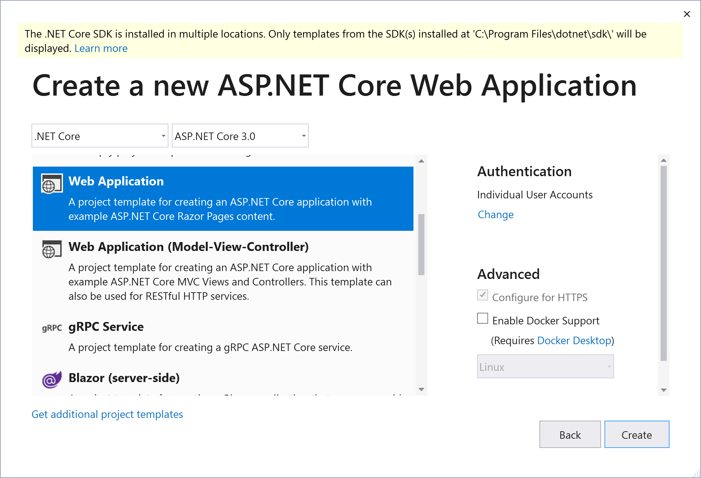

# Working with Razor Tag Helpers

## Look at Tag Helpers in the project template
1. Create a new ASP.NET Core project using the "Web Application" template with "Individual User Accounts" selected.

  

1. Open the view `Pages/Account/Register.cshtml`
1. Look at the Tag Helpers attributes being used in this view (examples: `asp-route-returnUrl`, `asp-validation-summary`) and play around with setting the attributes and exploring the IntelliSense offered for the different attribute types.
1. Run the application and see the HTML output by the Tag Helpers. Note that the Tag Helper attributes are not output in the HTML source.
1. Look at the other views in `Pages/Account/` folder to see how they use Tag Helpers.
1. Open the file `Pages/_Layout.cshtml`.
1. Look at the Tag Helpers being used in the `<head>` element and at the end of the page to render CSS stylesheets and JavaScript files and compare it to the generated HTML output.

## Create a custom Tag Helper
1. Create a new class in the application you created above, `public class RepeatTagHelper : TagHelper` and resolve any required namespaces
1. Add a property `public int Count { get; set; }`
1. Add an override for the `TagHelper.ProcessAsync()` method which repeats the content via the `output` parameter in a loop for `Count` iterations, e.g.:
  
  ``` C#
    public override async Task ProcessAsync(TagHelperContext context, TagHelperOutput output)
    {
        for (int i = 0; i < Count; i++)
        {
            output.Content.AppendHtml(await output.GetChildContentAsync(useCachedResult: false));
        }
    }
  ```

1. Open the `_ViewImports.cshtml` file and add a line to register your Tag Helper: `@addTagHelper *, Lab6` (adjust `Lab6` to your project/assembly name)
1. Open `Pages/Index.cshtml` and use your Tag Helper, e.g.:

  ``` HTML
  <repeat count="5">
    <h1>I'll be repeated!! @DateTime.UtcNow.Ticks</h1>
  </repeat>
  ```
  
1. Run the application again and ensure your Tag Helper is working
1. Note that the Tag Helper is rendering itself as a `<repeat>` tag (see it in the rendered HTML). We'll fix that now so that only the contents are rendered.
1. Open the `RepeatTagHelper` again and in the `ProcessAsync` method add a line to null out the tag name: `output.TagName = null;`
1. Run the application again and see that the outer tag is no longer rendered

## Extra if you have time
1. Experiment with decorating your `RepeatTagHelper` class with the `[HtmlTargetElement()]` attribute to change which HTML tag and/or attribute names to which it will attach itself.